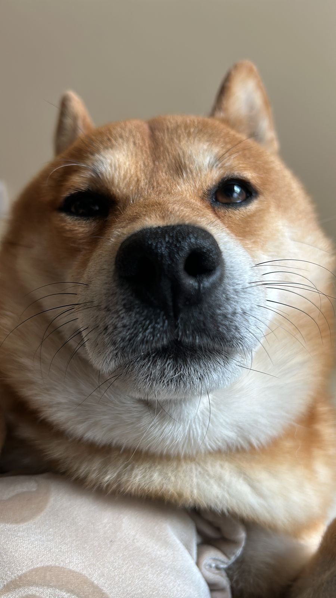

👋 **Hi there! I'm David.**

I'm a Machine Learning Engineer and Data Scientist with roots firmly planted in Civil Engineering. Currently, I'm diving deep into a Ph.D. at Polytechnique Montréal, where I’m exploring how neural networks can continuously learn and adapt—without losing their minds (or mine).

Whether it's ensuring infrastructure safety through advanced algorithms or navigating waves of data, I'm always looking for elegant solutions to complex problems.

---

### 🎯 **What drives my research:**

- 🧠 **Probabilistic Machine Learning**: Understanding uncertainty to build smarter, more reliable models.
- 🔄 **Online and Continual Learning**: Crafting AI systems that continuously evolve in real-time without forgetting their past.
- 📈 **Global Modelling of Time Series**: Capturing the big picture in temporal data, from earthquakes to financial markets.
- 🌉 **Structural Health Monitoring**: Keeping our infrastructure safe and sound using cutting-edge AI and sensor data.

---

### 📚 **My Academic Journey:**

- **Ph.D. in Engineering**, *Polytechnique Montréal* _(2024 - Present)_
- **Master of Engineering**, *American University of Beirut* _(2023)_
- **Bachelor’s of Engineering**, *Lebanese American University* _(2020)_

---

### 🏂🌊🐕 **When I'm off-duty...**

If I’m not fine-tuning neural nets, you'll probably find me balancing (or falling!) on something:

- 🏔️ **Snowboarding** down fresh powder slopes.
- 🌊 **Surfing** waves (still figuring out how gravity works).
- 🐕 Debating life choices with my stubborn Shiba Inu, who firmly believes he’s the boss (he is).

---

### 📫 **Let's Connect!**

I'm always happy to talk about research, ideas, or collaborations—or just share dog stories. Reach out:

- 💬 [LinkedIn](https://www.linkedin.com/in/david-wardan/)
- 🐙 [GitHub](https://github.com/davidwardan)
- 📧 [wardandavid@gmail.com](mailto:wardandavid@gmail.com)

---

*Last updated: March 28, 2025.*